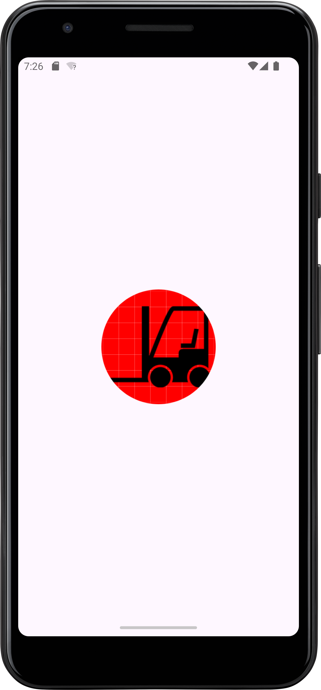
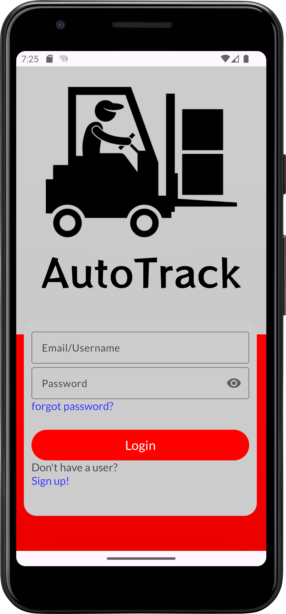
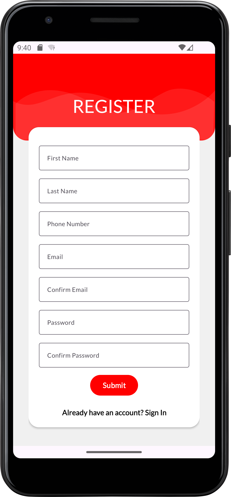
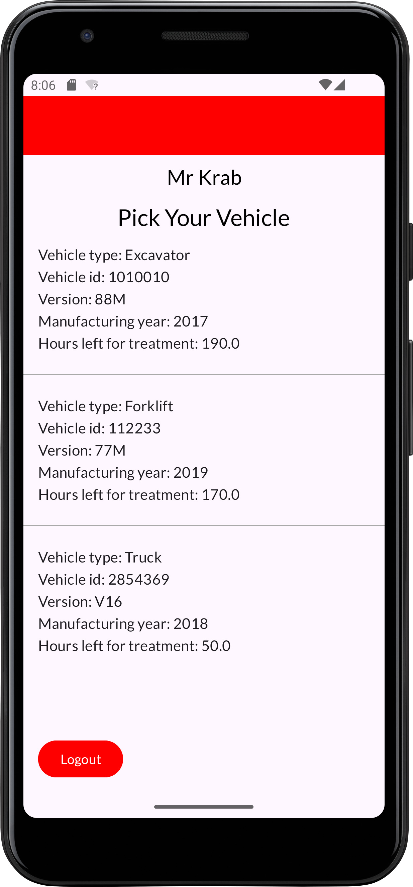
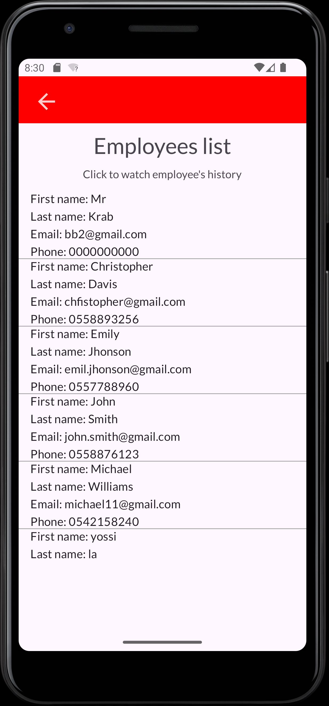
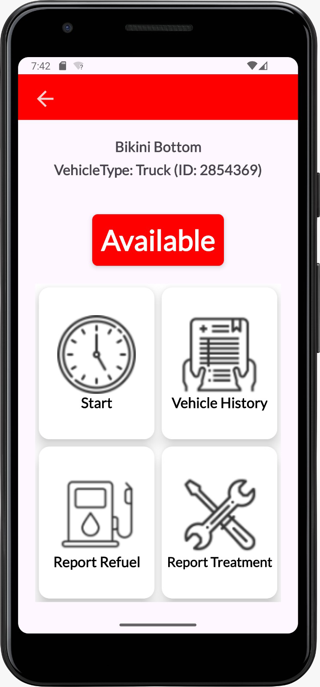

# AutoTrack

AutoTrack is an application designed to streamline the monitoring of treatments and refueling for heavy-duty vehicles in companies. Unlike private vehicles, heavy-duty vehicles require treatments after a certain number of engine hours rather than kilometers driven. AutoTrack aims to replace traditional paper-based logging systems used by employees to record vehicle usage, offering a digital solution for enhanced efficiency and accuracy.

## Features

### 1. Treatment Monitoring
- Track treatments required for heavy-duty vehicles based on engine hours.
- Receive notifications or alerts when vehicles are due for treatment.

### 2. Refueling Management
- Record refueling activities for vehicles.
- Keep track of fuel consumption and expenses.

### 3. Employee Monitoring
- Allow managers to monitor employee activities related to vehicle usage.
- View which employee treated, refueled, or drove which vehicle.

### 4. Vehicle History
- Provide access to comprehensive vehicle history for employees and managers.
- View past treatments, refueling activities, and driving records for each vehicle.

####  Some screenshots
      

## Getting Started

### Prerequisites
- Android device running Android 5.0 (Lollipop) or higher.
- Google Play services installed.
- Access to a Firebase Firestore database.

### Installation
1. Clone the repository to your local machine.
   ```
   git clone https://github.com/your-username/autotrack.git
   ```
2. Open the project in Android Studio.
3. Connect your Android device to your computer.
4. Build and run the application on your device.

### Configuration
1. Set up a Firebase project and enable Firestore database.
2. Configure the application to connect to your Firebase project by updating the `google-services.json` file.

## Usage
1. Sign in to the AutoTrack app using your credentials.
2. Navigate through the app to access various features such as treatment monitoring, refueling management, employee monitoring, and vehicle history.
3. Report vehicle activities such as treatments, refueling, and driving using the designated interfaces.
4. View and analyze vehicle history to track usage patterns and identify maintenance needs.

## Support
For any issues or inquiries regarding the AutoTrack app, please contact us.

## Contributing
We welcome contributions from the community to enhance the functionality and usability of the AutoTrack app. If you're interested in contributing, please follow these steps:
1. Fork the repository.
2. Create a new branch for your feature or enhancement.
3. Commit your changes and push them to your fork.
4. Submit a pull request with a detailed description of your changes.

## Contributors
Avi Ostroff
Noa Amichai
Aviya Oren
Israel Gitler

## License
This project is licensed under the MIT License - see the [LICENSE](LICENSE) file for details.
